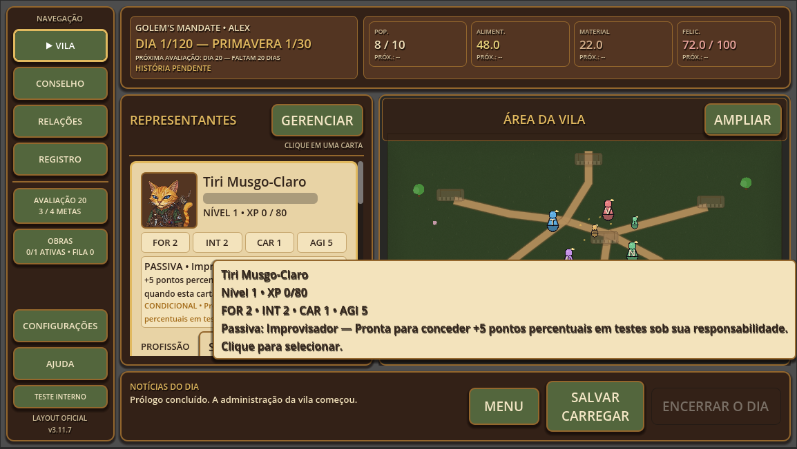

<h1 align="center">
  
</h1>

  

## ◈ About

**AI-Assisted Game Developer** focused on building games, experimental systems and practical tools with **Godot 4**.

I turn ideas into functional projects through rapid prototyping, testing and continuous refinement — combining human direction with AI-assisted development.

---

## ◈ Featured Projects

<table width="100%">
<tr>
<td valign="top">

### ◈ Golem's Mandate

A narrative village-management game developed with **Godot 4**, built around procedural characters, relationships, economy, construction and long-term consequences.

  
  
  
  

**Stable:** `v3.11.7`

  

  

  <b>Golem's Mandate</b> • Gameplay • Godot 4

</td>
</tr>
</table>

 

<table width="100%">
<tr>
<td valign="top">

### ◈ Godot Game Development Skills

An open collection of Portuguese-language skills for AI agents working with **Godot 4**, covering development, UX/UI, validation and MCP workflows.

  
  
  
  

**Focus:** reusable AI-assisted Godot workflows

</td>
</tr>
</table>

---

## ◈ How I Build

**Idea → Prototype → Test → Refine → Ship**

I build with **Godot 4** and **GDScript**, using AI throughout the development workflow for prototyping, implementation, analysis, testing and documentation.

AI is part of the process, while project direction, decisions, validation and continuous refinement shape the final result.

---

## ◈ Current Focus

I'm currently focused on:

- developing and refining **Golem's Mandate**;
- improving AI-assisted workflows for **Godot**;
- creating reusable skills and documentation for AI agents;
- exploring how human direction and artificial intelligence can work together to build complete projects.

---

  <b>◈ Imagine freely. Build relentlessly.</b>

  Built with Godot • Developed with AI-assisted workflows • Open Source

