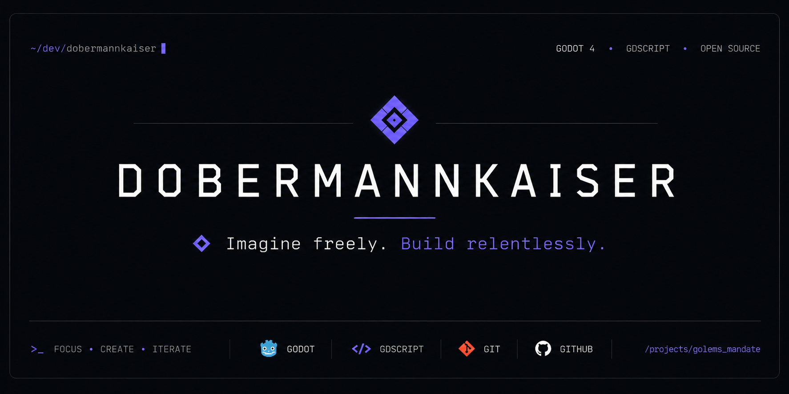

  

  

  
  &nbsp;&nbsp;
  

## ◈ About

**AI-Assisted Game Developer** focused on building games, experimental systems and practical tools with **Godot 4**.

I turn ideas into functional projects through rapid prototyping, testing and continuous refinement — combining human direction with AI-assisted development.

## ◈ Featured Projects

<table>
<tr>
<td width="50%" valign="top">

### ◈ Golem's Mandate

A narrative village-management game developed with **Godot 4**, built around procedural characters, relationships, economy, construction and long-term consequences.

  
  
  
  

**Stable:** `v3.11.7`

</td>
<td width="50%" valign="top">

### ◈ Godot Game Development Skills

An open collection of Portuguese-language skills for AI agents working with **Godot 4**, covering development, UX/UI, validation and MCP workflows.

  
  
  
  

**Focus:** reusable AI-assisted Godot workflows

</td>
</tr>
</table>

## How I Build

My development process combines:

- **Godot 4**
- **GDScript**
- **AI-assisted development**
- **Vibe coding**
- **rapid prototyping**
- **testing and iterative refinement**
- **documentation and reusable workflows**

I use artificial intelligence extensively throughout development, including programming, analysis, documentation, testing and iteration.

Rather than presenting AI-generated work as manually authored code, I prefer to be transparent about the process and focus on the quality, usefulness and reproducibility of the final result.

## Current Focus

I'm currently focused on:

- developing and refining **Golem's Mandate**;
- improving AI-assisted workflows for **Godot**;
- creating reusable skills and documentation for AI agents;
- exploring how human direction and artificial intelligence can work together to build complete projects.

---

**◈ Imagine freely. Build relentlessly.**
